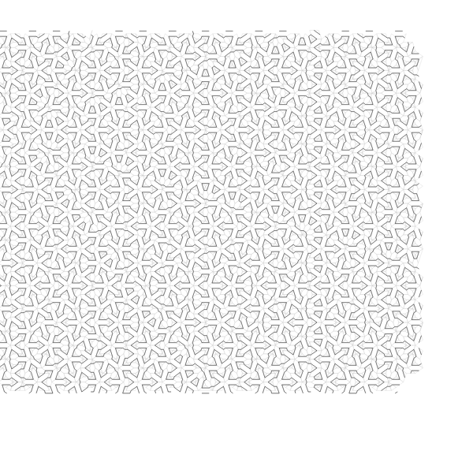
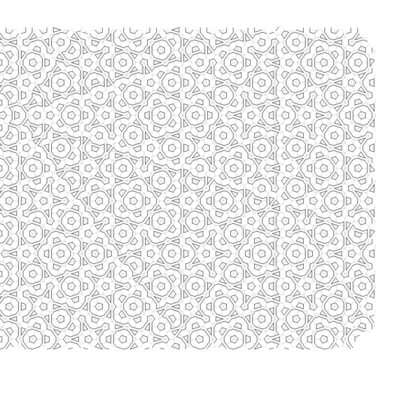
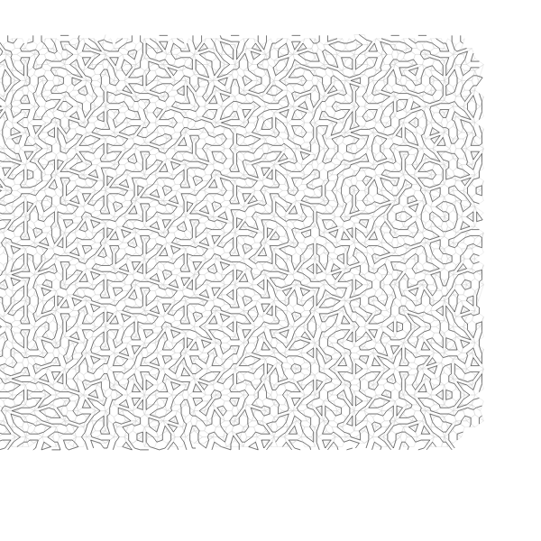
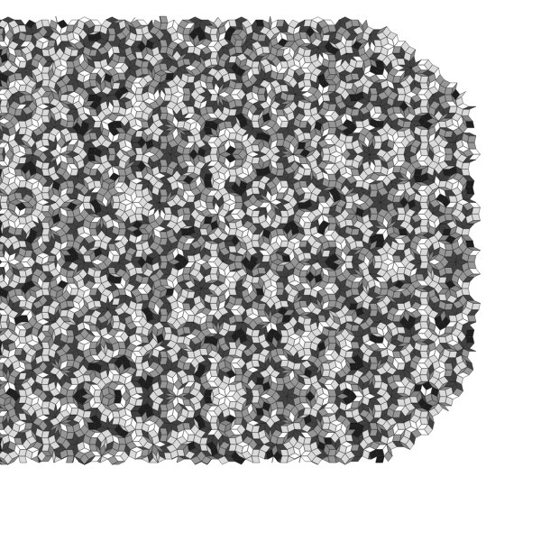
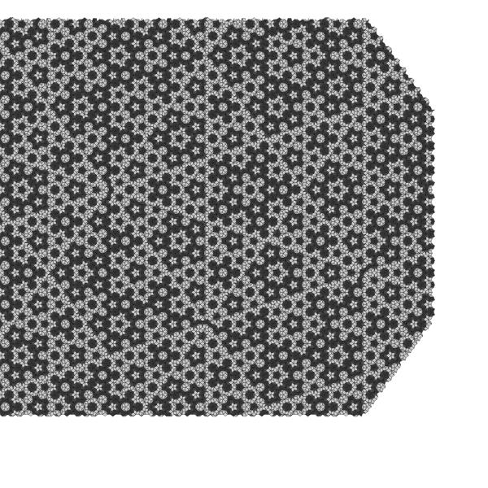
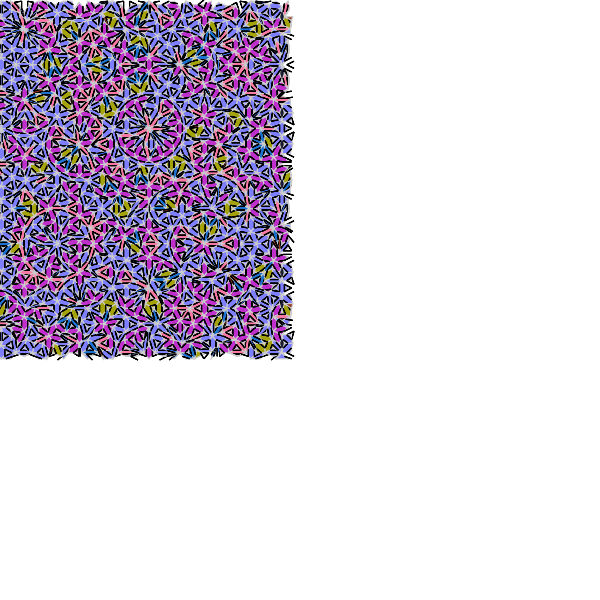
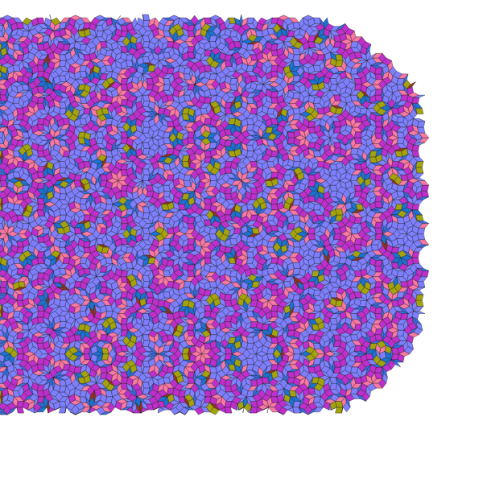
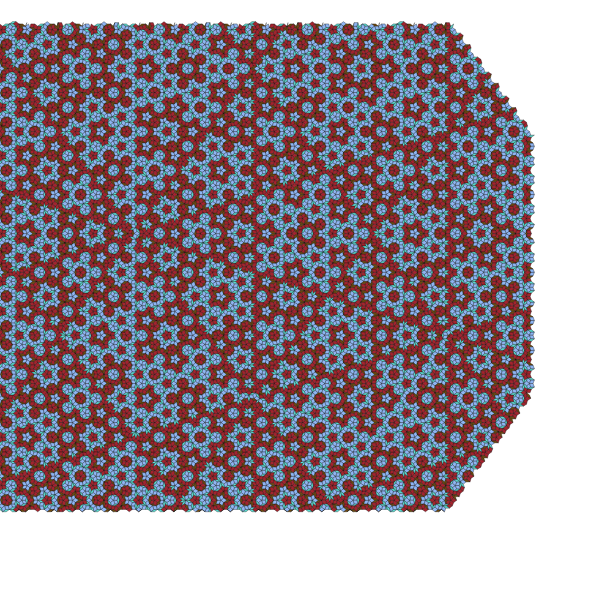

# quasi-svg — SVG quasicrystals in JS

This is a port of Eric Weeks' `quasi.c`, which can still be found all the way back in 1995:
http://www.physics.emory.edu/faculty/weeks/software/quasic.html.

I made a few modifications, including supporting SVG output in addition to PostScript, but overall
the heart of the generator is a straight port. As such, it has a certain amount of undocumented
magic (it also looks a lot more like C than the usual JS).

It should be relatively straightforward to add canvas support as well. If you're interested and have
questions, don't hesitate to contact me.

## Node Installation

Nothing but the usual:

    npm install quasi-svg

## In the browser

Just use one of the files (minified or not) from inside `dist`. Only the SVG module is provided,
PostScript somehow seemed redundant in the browser. The file contains the minimal Browserify AMD
code; if it's not loaded through a module system it makes itself available using the `Quasi` global.
You can then call `Quasi.svg()` with some options.

## API

If you `require("quasi-svg")` the following three methods are available. They can also be required
individually as `quasi-svg/svg` for the SVG part, `quasi-svg/ps` to generate PostScript, and
`quasi-svg/quasi` for the core engine.

* `svg([options])`. Takes some options and generates an SVG string. Same options as `ps()`.
* `ps([options])` Takes some options and generates a PostScript string. The options are an object 
  with the following keys, all optional:
  * `size` (Number). A scaling factor.
  * `fillPolygons` (Boolean). Fills the polygons.
  * `fillColor` (Boolean). Fill colour is according to polygon type (also sets `fillPolygons`).
  * `rotate` (Boolean). Flip 90°.
  * `magnify` (Number). Magnification factor.
  * `skinnyMidpoint` (Enum) Midpoint type for skinny diamonds, takes enumerated values below.
  * `fatMidpoint` (Enum) Midpoint type for fat diamonds, takes enumerated values below.
    * `1`: acute angle sides joined
    * `2`: obtuse angle sides joined
    * `3`: opposite sides joined to make cross
    * `4`: all sides joined to make rectangle
    * `5`: randomly choose 1 or 2
    * `6`: randomly choose 1, 2, or 4
  * `symmetry` (Int). Degrees of symmetry.
  * `lines` (Int). Number of lines to use.
  * `strokeWidth` (Number). The stroke width for drawing.
  * `color` (Boolean). To be used with `fillColor`, if set will generate pretty-looking colours for
    the fills.
* `quasi(options, writer)`. This is the core engine that generates the quasicrystals. It takes the
  same options as the other two plus a `writer`. The writer is basically an object that quasi 
  controls in order to tell it to produce the output. Look at the source of the `svg` and `ps`
  modules for details.

## Examples

Here are a few examples (you can get a fair bit fancier). Note that they are also available as SVG,
but GitHub will only let you embed PNG (for good reasons, too):

### The default output

### skinnyMidpoint=1, fatMidpoint=1

### skinnyMidpoint=1, fatMidpoint=2

### skinnyMidpoint=2, fatMidpoint=1

### skinnyMidpoint=2, fatMidpoint=2

### skinnyMidpoint=3, fatMidpoint=3

### skinnyMidpoint=5, fatMidpoint=5

### symmetry=14

### fillColor=true, magnify=0.6, symmetry=7

### fillColor=true, lines=80, magnify=0.3

### Several variants with color=true

